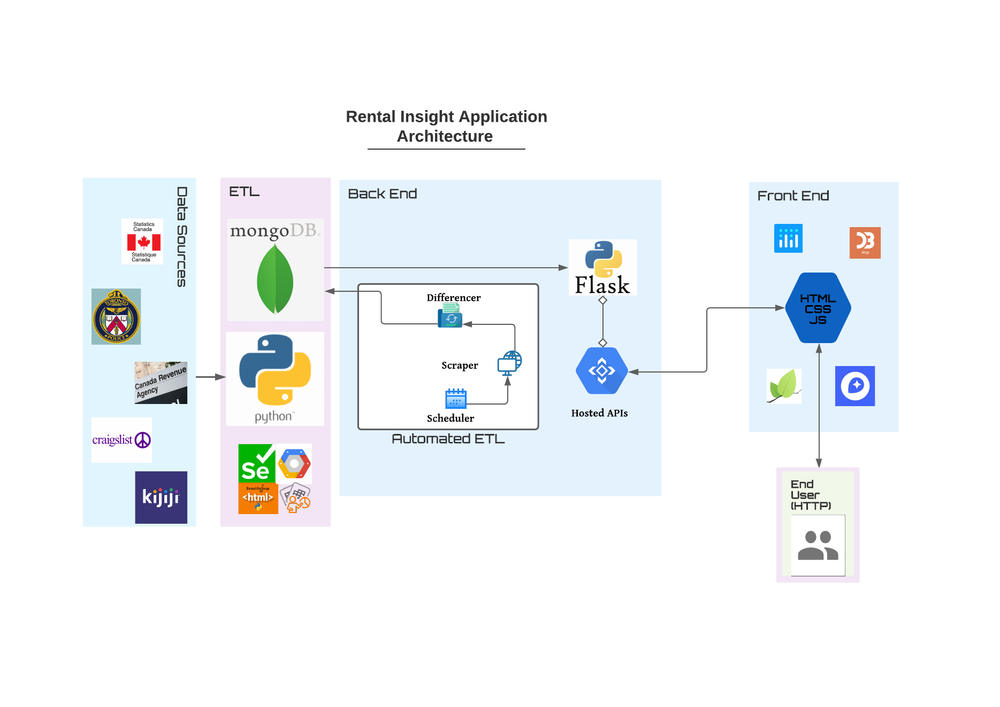
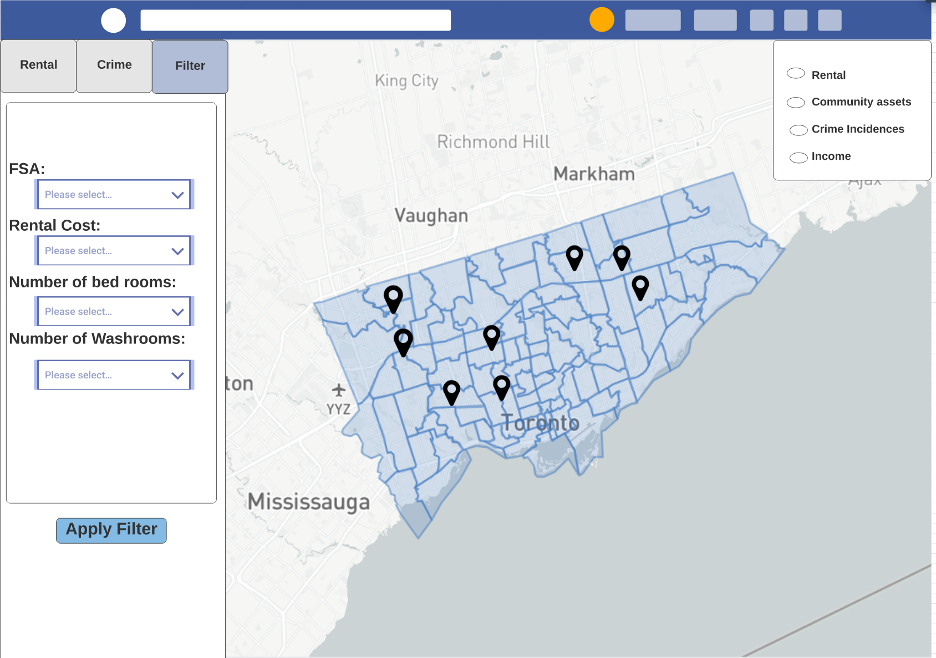
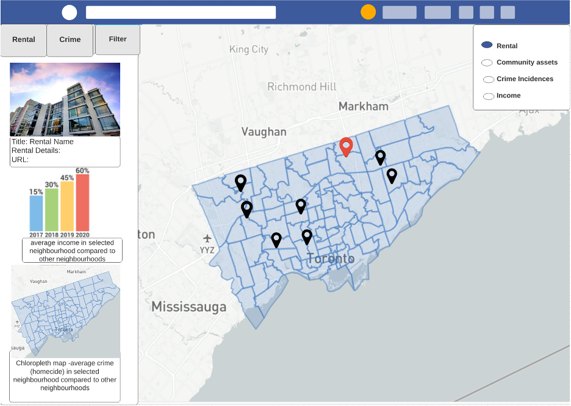
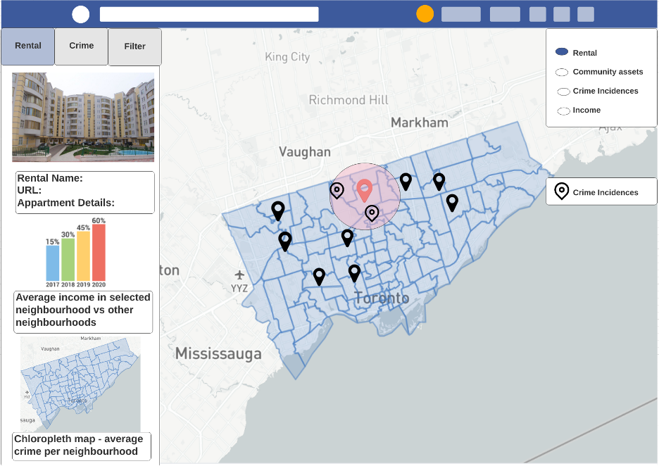

# Toronto Rental Insight App
This project is a continuation of the Toronto_Rental_ETL_Project. The Toronto_Rental_ETL_Project scraped, cleaned, transformed and stored data from multiple data sources and made it available for use through a Flask API which can be found [here](https://github.com/bnarath/Toronto_Rental_ETL_Project/blob/master/README.md). **This project aims to further automate the task of acquiring the data by using a scheduler that will scrape the data sources on a daily basis and update the database and provide the much granular data using improvised API services. This project also aims to make this data available to users for exploration through the creation of a user friendly, interactive dashboard, and finally hosting the application in the cloud.**


## Project Intro/Objective
The applications that provide classified rental services like `Craigslist` and `Kijiji` **focus on providing details regarding only the listed rentals. That doesn't necessarily mean all what the users are looking for.**  One would be truly interested to know `how safe the neighbourhood is?` What are `the community services available` in the neighborhood to use?, What is the `socio-economic status of the location (like average income and age) ?` **That is what this project is all about; to provide the users with all they want about and around the rental listings!!** The purpose of this project is to help users find a rental property that fits within their budget as well as other requirements such as being located in a crime free neighborhood and is in close proximity to community services such as schools and healthcare centers. To be specific, the purpose of this project is to help users find a rental property that fits within their budget as well as other requirements such as being located in a crime free neighborhood and is in close proximity to community services such as schools and healthcare centers.

### Data Sources
* Toronto Rental Data - [Craigslist](https://toronto.craigslist.org/search/hhh), [Kijiji](https://www.kijiji.ca/) - Though Scraping
* Crime Data - [Toronto Police Services Open Data](https://data.torontopolice.on.ca/pages/catalogue) - Through API
* Community Services Data - [Toronto Public Services](https://torontops.maps.arcgis.com/home/item.html?) - Through Scraping
* Income & Age Data - [Canada Revenue Agency](https://www.canada.ca/en/revenue-agency/programs/about-canada-revenue-agency-cra/income-statistics-gst-hst-statistics/individual-tax-statistics-fsa/individual-tax-statistics-fsa-2017-edition-2015-tax-year.html#toc9) & [Stats Canada](https://www.statcan.gc.ca/)- Through static files

### Methods Used
- Data Extraction (Selenium, BeautifulSoup, google API, mapquest API)
- Data Transformation (Python - pandas, numpy, regex)
- Data Loading (MongoDB - cloud, MongoClient)
- Automation of Extraction, Transformation & Load (Advanced Python Scheduler - Heroku )
- API services - Flask 
- Data Visualization (Leaflet :- leaflet sidebar(extension), heatmap(plugin), Leaflet Panel Layers(plugin), Plotly, D3(Data handling for visuals)

## Project Architecture



**Architecture consists of `full stack` - `Automated ETL` -> `Python - Flask` -> `HTML/CSS/JS`**

### Automated ETL
- **Extract:** Extracts the data from `Kijiji, Craigslist, Toronto Police Services(TPS),  Canada Revenue Agency (CRA), and Stats Canada` using `Scraping` and  API services.`

- **Transform:** Transformation of data through `various python packages` including pandas and numpy.

- **Load:** Loads the data to the `cloud MongoDB(Atlas) database.` ETL is separate from the cloud application. Serves as a separate functionality to extract, transform and preload the database. 

- **Automation** - **The process of Extraction of rental data (only from Craigslist), Transform and Load is automated.**
  - **Scraper:** 
    Crawls the Rental Data from Craigslist
  - **Scheduler: Hosted in Heroku as a separate Scheduling Application** 
    Schedules ETL every day at 4.30 AM EDT (If you wonder why, There is no specific reason for this specific time !!)
  - **Differencer:**
    - Updates the current and historical rental DB Tables. 
    - Current rental data - consists of only the current available rental listings.
    - Historic rental data - consists of all rental listings.
  
  A snippet of automated ETL process is shown below (heroku logs).
  ```diff
  2020-09-26T04:30:00.001509+00:00 app[clock.1]: Started updateDB
  2020-09-26T04:34:04.395572+00:00 app[clock.1]: Finished craigs_list_api_call
  2020-09-26T04:34:05.423526+00:00 app[clock.1]: Finished differencer
  2020-09-26T04:34:06.736165+00:00 app[clock.1]: Finished instatiate_driver
  2020-09-26T04:34:13.404711+00:00 app[clock.1]: Finished craigs_list_scrape
  2020-09-26T04:34:13.434493+00:00 app[clock.1]: Finished clean_craigslist
  2020-09-26T04:34:13.448337+00:00 app[clock.1]: Finished geocode
  2020-09-26T04:34:13.924970+00:00 app[clock.1]: Finished fill_Lat_Long
  2020-09-26T04:34:13.953593+00:00 app[clock.1]: Finished clean_rental_for_merg
  2020-09-26T04:34:14.026133+00:00 app[clock.1]: Finished updateDB
  2020-09-26T04:34:14.033489+00:00 app[clock.1]: Finished Updating the DB
  ```

  ```diff
  2020-09-28T04:34:28.051408+00:00 app[clock.1]: Finished craigs_list_api_call
  2020-09-28T04:34:28.999139+00:00 app[clock.1]: Finished differencer
  2020-09-28T04:34:31.631729+00:00 app[clock.1]: Finished instatiate_driver
  2020-09-28T04:36:11.449854+00:00 app[clock.1]: Finished craigs_list_scrape
  2020-09-28T04:36:11.494136+00:00 app[clock.1]: Finished clean_craigslist
  2020-09-28T04:36:14.459126+00:00 app[clock.1]: Finished fill_Lat_Long
  2020-09-28T04:36:14.520678+00:00 app[clock.1]: Finished clean_rental_for_merg
  2020-09-28T04:36:14.729932+00:00 app[clock.1]: Finished updateDB
  2020-09-28T04:36:14.737698+00:00 app[clock.1]: Finished Updating the DB
  ```

  ```diff
  2020-09-29T04:35:03.578897+00:00 app[clock.1]: Finished craigs_list_api_call
  2020-09-29T04:35:04.963784+00:00 app[clock.1]: Finished differencer
  2020-09-29T04:35:08.886718+00:00 app[clock.1]: Finished instatiate_driver
  2020-09-29T04:40:11.930050+00:00 app[clock.1]: Finished craigs_list_scrape
  2020-09-29T04:40:12.024977+00:00 app[clock.1]: Finished clean_craigslist
  2020-09-29T04:40:20.150364+00:00 app[clock.1]: Finished fill_Lat_Long
  2020-09-29T04:40:20.215436+00:00 app[clock.1]: Finished clean_rental_for_merg
  2020-09-29T04:40:20.488990+00:00 app[clock.1]: Finished updateDB
  2020-09-29T04:40:20.495897+00:00 app[clock.1]: Finished Updating the DB
  ```
### Python - Flask
**Handles request from front end Javascript, Inteacts with MongoDB and provides the requested data in JSON format**
- **API endpoints:** Hosts the API endpoints
We have multiple API end points; all deliver relevant data through static and dynamic queries.
**`API end points:`**
- **Rental**
  - Static endpoints
    - [All available rental listings](https://etlinsightapi.herokuapp.com/availableRental)
    - [Historic rental listings](https://etlinsightapi.herokuapp.com/rentalTrend)
  - Dynamic query to fetch data (Just an example below)
    - [Fetch the rental based on your filters on - price range, sqft range , bedrooms and bathrooms ](https://etlinsightapi.herokuapp.com/availableRental?sqft=[1000,-1]&price=[1500,2500]&bedrooms=[2,-1]&bathrooms=[1,-1]&FSA=M4E)
- **Crime**
  - Static endpoints
    - [Last year](https://etlinsightapi.herokuapp.com/crimeLastYear)
    - [Last 6 months](https://etlinsightapi.herokuapp.com/crimeLastSixMonths)
    - [Last 3 months](https://etlinsightapi.herokuapp.com/CrimeLastThreeMonths)
    - [Last 1 month](https://etlinsightapi.herokuapp.com/CrimeLastMonth)
  - Dynamic query to fetch data (Just an example below)
    - [Fetch the crime data based on MCI ](https://etlinsightapi.herokuapp.com/crimeLastYear?MCI=Break%20and%20Enter)
    - Options for MCI:-['Assault', 'Auto Theft', 'Break and Enter', 'Homicide', 'Robbery', 'Theft Over']
 - **Community Assets**
    - Static endpoints
      - [All community assets](https://etlinsightapi.herokuapp.com/communityAssets)
    - Dynamic query to fetch data (Just an example below)
      - [Fetch the community assets based on - FSA](https://etlinsightapi.herokuapp.com/communityAssets?category=Food%20%26%20Housing&fsa=M1P)
      - Options for category:- ['Community Services','Education & Employment','Financial Services','Food & Housing','Health Services','Law & Government','Transportation']
      - Note: Replace `&` with `%26` in URL
- **FSA income & age**
  - Static endpoints
    - [All FSA vs Age & Income](https://etlinsightapi.herokuapp.com/fsaIncomeAge)
  - [Fetch the average age and income based on - FSA](https://etlinsightapi.herokuapp.com/fsaIncomeAge?FSA=M4E)
  
 

```diff
2020-09-26T04:30:00.001509+00:00 app[clock.1]: Started updateDB
2020-09-26T04:34:04.395572+00:00 app[clock.1]: Finished craigs_list_api_call
2020-09-26T04:34:05.423526+00:00 app[clock.1]: Finished differencer
2020-09-26T04:34:06.736165+00:00 app[clock.1]: Finished instatiate_driver
2020-09-26T04:34:13.404711+00:00 app[clock.1]: Finished craigs_list_scrape
2020-09-26T04:34:13.434493+00:00 app[clock.1]: Finished clean_craigslist
2020-09-26T04:34:13.448337+00:00 app[clock.1]: Finished geocode
2020-09-26T04:34:13.924970+00:00 app[clock.1]: Finished fill_Lat_Long
2020-09-26T04:34:13.953593+00:00 app[clock.1]: Finished clean_rental_for_merg
2020-09-26T04:34:14.026133+00:00 app[clock.1]: Finished updateDB
2020-09-26T04:34:14.033489+00:00 app[clock.1]: Finished Updating the DB
```

```diff
2020-09-28T04:34:28.051408+00:00 app[clock.1]: Finished craigs_list_api_call
2020-09-28T04:34:28.999139+00:00 app[clock.1]: Finished differencer
2020-09-28T04:34:31.631729+00:00 app[clock.1]: Finished instatiate_driver
2020-09-28T04:36:11.449854+00:00 app[clock.1]: Finished craigs_list_scrape
2020-09-28T04:36:11.494136+00:00 app[clock.1]: Finished clean_craigslist
2020-09-28T04:36:14.459126+00:00 app[clock.1]: Finished fill_Lat_Long
2020-09-28T04:36:14.520678+00:00 app[clock.1]: Finished clean_rental_for_merg
2020-09-28T04:36:14.729932+00:00 app[clock.1]: Finished updateDB
2020-09-28T04:36:14.737698+00:00 app[clock.1]: Finished Updating the DB
```

```diff
2020-09-29T04:35:03.578897+00:00 app[clock.1]: Finished craigs_list_api_call
2020-09-29T04:35:04.963784+00:00 app[clock.1]: Finished differencer
2020-09-29T04:35:08.886718+00:00 app[clock.1]: Finished instatiate_driver
2020-09-29T04:40:11.930050+00:00 app[clock.1]: Finished craigs_list_scrape
2020-09-29T04:40:12.024977+00:00 app[clock.1]: Finished clean_craigslist
2020-09-29T04:40:20.150364+00:00 app[clock.1]: Finished fill_Lat_Long
2020-09-29T04:40:20.215436+00:00 app[clock.1]: Finished clean_rental_for_merg
2020-09-29T04:40:20.488990+00:00 app[clock.1]: Finished updateDB
2020-09-29T04:40:20.495897+00:00 app[clock.1]: Finished Updating the DB
```
### FrontEnd
FrontEnd Consists of the `HTML/CSS/Javascript stack`. Javscript retrieves the data from the APIs hosted by Flask based on user's selection 


## Frontend Wireframes 

The dashboard will consist of map and a sidebar. 

### Map

The leaflet library will be used to display a map of Toronto with FSA boundaries outlined. By default, the map will show markers for the daily rental postings. The map will include a toggle bar that will enable users to add/remove markers for:
* Rental postings
* Community assets
* Crime incidence (past 6 months).   

The map will included the following functionalities:
* tooltip when hovering over markers
* Upon clicking on a rental posting marker, a circle will show a 1 km radius around the marker. Other markers will appear within that circle's radius showing crime incidences that occurred in the past 6 months. 


### Sidebar

By default/opening dashboard, the side bar will contain dropdown menus that enable users to filter the rental posting markers display by:
* FSA
* Rental cost
* Number of bedrooms
* Number of washrooms



A filter button at the top of the sidebar will enable users to toggle back to this view. 

Otherwise, there will be three versions of the sidebar based on how users interact with the map.

#### Click on Rental Posting Marker
* Rental posting details
* Bar chart of average income with FSA compared to Toronto overall
* Heat map of Toronto showing crime incidence


#### Click on Community Asset Marker
* Community Asset information 


#### Click on FSA

The sidebar will have buttons to toggle views between crime data and rental posting data.

Rental posting data
* bar graph displaying average cost to rent in FSA (data scrapped that day) by number of bedrooms.
* line graph displaying average to rent in FSA over time (historical/trending data) by number of bedrooms.


Crime data
* bar graph displaying average cost to rent in FSA (data scrapped that day) by number of bedrooms.
* line graph displaying average to rent in FSA over time (historical/trending data) by number of bedrooms.



### Technologies
* Python
  * Extraction
    * BeautifulSoap
    * Selenium
  * Transformation
    * Pandas
    * Numpy
    * Regex
* MongoDB
  * MongoClient
  * Atlas
* JavaScript
  * D3
  * Leaflet
    * Sidebar
    * Leaflet Panel
    * Heatmap
    * Mapbox
  * Plotly
* Web
  * HTML
  * CSS
  * BootStrap
